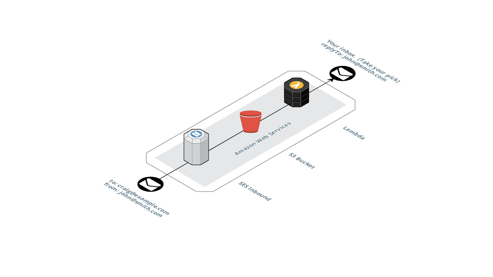

# mailtube
Receive inbound email from your own domain and send to a private inbox.

### AWS Services  
`SES` Receive email with appropriate MX records.  
`S3` Inbound emails are saved (by SES) to S3.  
`Lambda` is triggered by the S3 PUT event, and sends the email onward.  

### NPMs  
`serverless` Packaging & deployment.  
`mailparser` To read the raw object from s3.  
`nodemailer` To send it onward - with attachments.  

